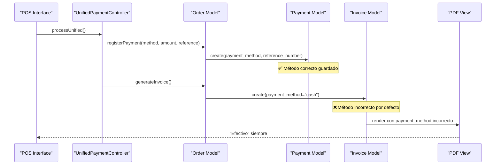
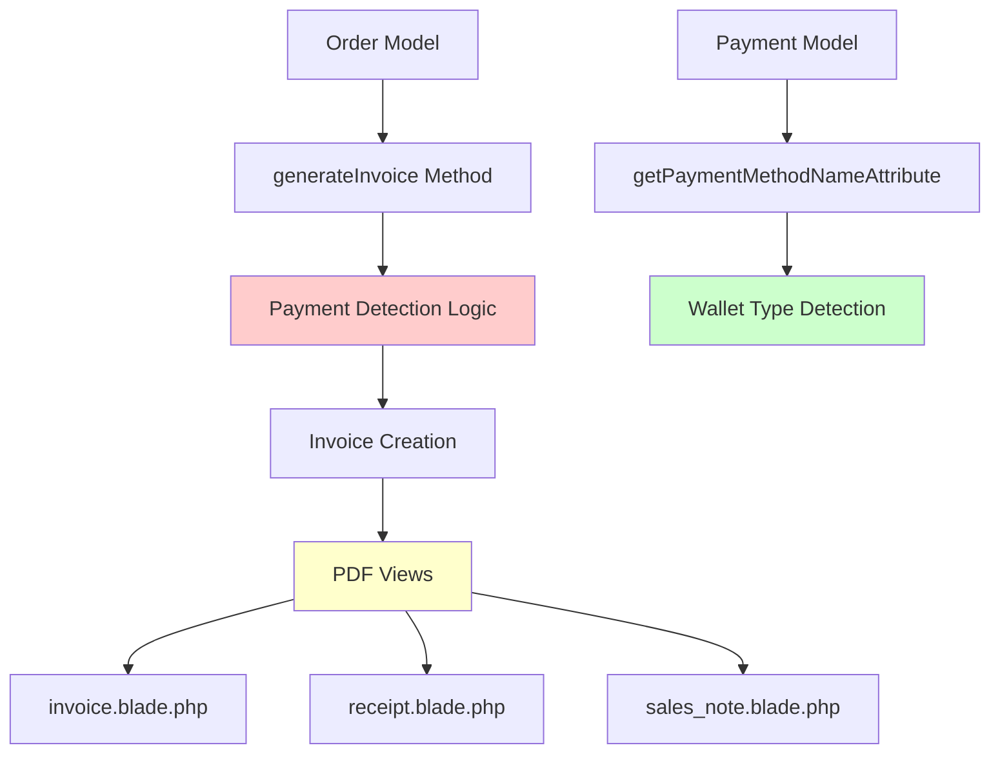
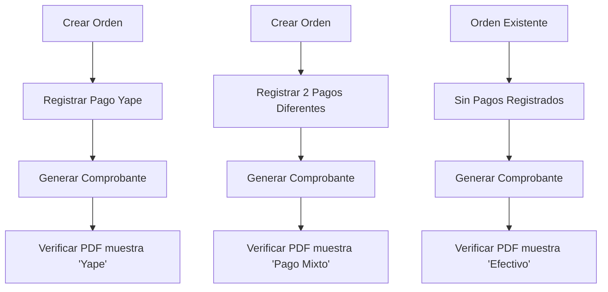
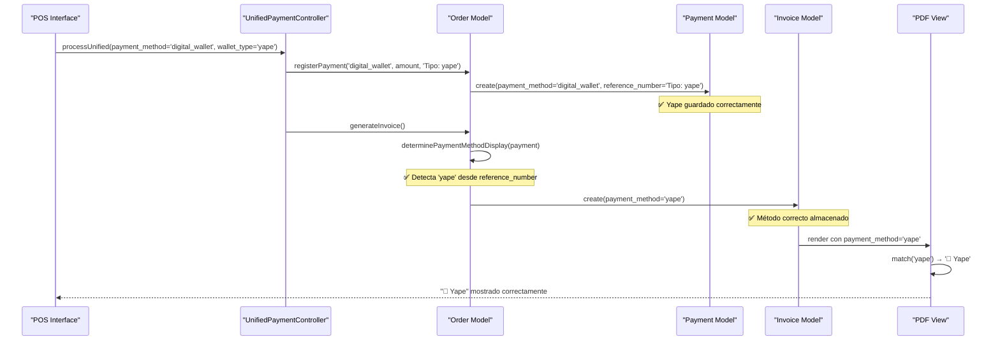

# Diseño de Solución: Método de Pago Correcto en Comprobantes

## Resumen

Solución para corregir la visualización incorrecta del método de pago en los PDFs de comprobantes (facturas, boletas y notas de venta) en el sistema de restaurante. Actualmente, todos los comprobantes muestran "Efectivo" independientemente del método de pago real utilizado.

## Análisis del Problema

### Problema Identificado
Los comprobantes generados muestran "Efectivo" como método de pago en lugar del método real utilizado (Yape, Plin, tarjeta, etc.).

### Causa Raíz
1. **Flujo de Datos Incorrecto**: El campo `payment_method` en la tabla `invoices` no se está llenando correctamente con el método de pago real
2. **Lógica Defectuosa**: En el método `generateInvoice()` del modelo `Order`, la lógica para determinar el método de pago principal tiene errores
3. **Mapeo Inadecuado**: Las billeteras digitales (Yape, Plin) no se están identificando correctamente desde el campo `reference_number`

### Contexto Técnico



## Arquitectura de la Solución

### Componentes Afectados



### Flujo de Solución

1. **Mejorar Detección de Método de Pago**: Corregir la lógica en `generateInvoice()` para detectar correctamente el método de pago principal
2. **Identificar Billeteras Digitales**: Extraer tipo específico (Yape, Plin) desde `reference_number` en pagos de tipo `digital_wallet`
3. **Actualizar Vistas PDF**: Modificar las vistas para mostrar el método de pago correcto con mejor presentación

## Especificación Técnica

### 1. Corrección en Order Model

#### Método `generateInvoice()` - Líneas 859-863

**Estado Actual:**
```php
// Determinar método de pago principal para mostrar en el comprobante
$primaryPaymentMethod = 'cash'; // Por defecto efectivo ❌
if ($this->payments()->count() === 1) {
    $primaryPaymentMethod = $this->payments()->first()->payment_method;
} elseif ($this->payments()->count() > 1) {
    $primaryPaymentMethod = 'mixto';
}
```

**Solución Propuesta:**
```php
// Obtener todos los pagos de la orden
$orderPayments = $this->payments()->get();
$totalPaid = $orderPayments->sum('amount');

// Determinar método de pago principal para mostrar en el comprobante
$primaryPaymentMethod = 'cash'; // Fallback por defecto

if ($orderPayments->count() === 1) {
    // Un solo pago: usar ese método específico
    $singlePayment = $orderPayments->first();
    $primaryPaymentMethod = $this->determinePaymentMethodDisplay($singlePayment);
} elseif ($orderPayments->count() > 1) {
    // Múltiples pagos: mostrar como "mixto"
    $primaryPaymentMethod = 'mixto';
} elseif ($orderPayments->count() === 0) {
    // Sin pagos registrados: mantener efectivo como fallback
    $primaryPaymentMethod = 'cash';
}
```

### 2. Nuevo Método de Utilidad

#### `determinePaymentMethodDisplay()` en Order Model

```php
/**
 * Determina el método de pago para mostrar en el comprobante
 */
private function determinePaymentMethodDisplay(Payment $payment): string
{
    // Si es billetera digital, verificar el tipo específico en reference_number
    if ($payment->payment_method === 'digital_wallet' && $payment->reference_number) {
        if (str_contains(strtolower($payment->reference_number), 'yape')) {
            return 'yape';
        } elseif (str_contains(strtolower($payment->reference_number), 'plin')) {
            return 'plin';
        }
        // Si no se puede determinar, mantener como digital_wallet genérico
        return 'digital_wallet';
    }
    
    // Para otros métodos, devolver tal como está
    return $payment->payment_method;
}
```

### 3. Mejora en Payment Model

#### Método `getPaymentMethodNameAttribute()` - Líneas 69-84

**Mejorar la detección existente:**
```php
public function getPaymentMethodNameAttribute(): string
{
    // Verificar si es una billetera digital y tiene un tipo específico
    if ($this->payment_method === self::METHOD_DIGITAL_WALLET && $this->reference_number) {
        $reference = strtolower($this->reference_number);
        if (str_contains($reference, 'yape')) {
            return 'Yape';
        } elseif (str_contains($reference, 'plin')) {
            return 'Plin';
        }
    }

    // Mapeo estándar de métodos de pago
    return match($this->payment_method) {
        self::METHOD_CASH => 'Efectivo',
        self::METHOD_CARD => 'Tarjeta',
        self::METHOD_CREDIT_CARD => 'Tarjeta de Crédito',
        self::METHOD_DEBIT_CARD => 'Tarjeta de Débito',
        self::METHOD_BANK_TRANSFER => 'Transferencia Bancaria',
        self::METHOD_DIGITAL_WALLET => 'Billetera Digital',
        'yape' => 'Yape',
        'plin' => 'Plin',
        'mixto' => '💳 Pago Mixto',
        default => ucfirst(str_replace('_', ' ', $this->payment_method)),
    };
}
```

### 4. Actualización de Vistas PDF

#### En `invoice.blade.php`, `receipt.blade.php`, `sales_note.blade.php`

**Cambio en la Sección de Forma de Pago (líneas ~383-396):**

**Estado Actual:**
```php
<p><strong>FORMA DE PAGO:</strong>
    {{ ucfirst(match($invoice->payment_method ?? 'cash') {
        'cash' => 'Efectivo',
        // ... resto del mapeo
    }) }}
</p>
```

**Solución Propuesta:**
```php
@php
    // Determinar el método de pago a mostrar
    $displayPaymentMethod = $invoice->payment_method ?? 'cash';
    
    // Si hay pagos asociados, usar el método real
    if ($invoice->order && $invoice->order->payments && $invoice->order->payments->count() > 0) {
        if ($invoice->order->payments->count() === 1) {
            $singlePayment = $invoice->order->payments->first();
            $displayPaymentMethod = $singlePayment->payment_method;
            
            // Verificar si es billetera digital con tipo específico
            if ($singlePayment->payment_method === 'digital_wallet' && $singlePayment->reference_number) {
                $reference = strtolower($singlePayment->reference_number);
                if (str_contains($reference, 'yape')) {
                    $displayPaymentMethod = 'yape';
                } elseif (str_contains($reference, 'plin')) {
                    $displayPaymentMethod = 'plin';
                }
            }
        } else {
            $displayPaymentMethod = 'mixto';
        }
    }
@endphp

<p><strong>FORMA DE PAGO:</strong>
    {{ ucfirst(match($displayPaymentMethod) {
        'cash' => 'Efectivo',
        'card' => 'Tarjeta',
        'credit_card' => 'Tarjeta de Crédito',
        'debit_card' => 'Tarjeta de Débito',
        'bank_transfer' => 'Transferencia Bancaria',
        'digital_wallet' => 'Billetera Digital',
        'yape' => '📱 Yape',
        'plin' => '📱 Plin',
        'mixto' => '💳 Pago Mixto',
        'multiple' => '💳 Pago Múltiple',
        default => ucfirst(str_replace('_', ' ', $displayPaymentMethod))
    }) }}
</p>
```

## Casos de Uso Cubiertos

### Caso 1: Pago Único con Yape
- **Input**: 1 pago con `payment_method='digital_wallet'` y `reference_number='Tipo: yape'`
- **Output**: PDF muestra "📱 Yape"

### Caso 2: Pago Único con Tarjeta
- **Input**: 1 pago con `payment_method='card'`
- **Output**: PDF muestra "Tarjeta"

### Caso 3: Pago Mixto
- **Input**: 2+ pagos con diferentes métodos
- **Output**: PDF muestra "💳 Pago Mixto"

### Caso 4: Sin Pagos (Fallback)
- **Input**: Orden sin pagos registrados
- **Output**: PDF muestra "Efectivo"

## Validación y Testing

### Pruebas Requeridas



### Criterios de Aceptación

1. ✅ **Pago Único Yape**: Comprobante muestra "📱 Yape"
2. ✅ **Pago Único Plin**: Comprobante muestra "📱 Plin"
3. ✅ **Pago Único Tarjeta**: Comprobante muestra "Tarjeta"
4. ✅ **Pago Mixto**: Comprobante muestra "💳 Pago Mixto"
5. ✅ **Compatibilidad Retroactiva**: Órdenes existentes sin pagos muestran "Efectivo"
6. ✅ **Consistencia**: Todos los tipos de comprobante (factura, boleta, nota de venta) muestran el método correcto

## Consideraciones de Implementación

### Impacto en Rendimiento
- **Mínimo**: La solución agrega consultas simples a relaciones ya existentes
- **Optimización**: Usar `with(['payments'])` en controladores para evitar N+1 queries

### Compatibilidad
- **Retroactiva**: Órdenes existentes sin pagos registrados seguirán mostrando "Efectivo"
- **Base de Datos**: No requiere migraciones, solo cambios en lógica de aplicación

### Logs y Debugging

Agregar logging para trazabilidad:

```php
Log::info('📋 Método de pago determinado para comprobante', [
    'invoice_id' => $invoice->id,
    'order_id' => $this->id,
    'payments_count' => $orderPayments->count(),
    'primary_payment_method' => $primaryPaymentMethod,
    'payments_detail' => $orderPayments->map(function($p) {
        return [
            'method' => $p->payment_method,
            'amount' => $p->amount,
            'reference' => $p->reference_number
        ];
    })->toArray()
]);
```

## Arquitectura Final



Esta solución garantiza que el método de pago correcto se refleje en todos los comprobantes generados, mejorando la precisión y profesionalismo del sistema de facturación.