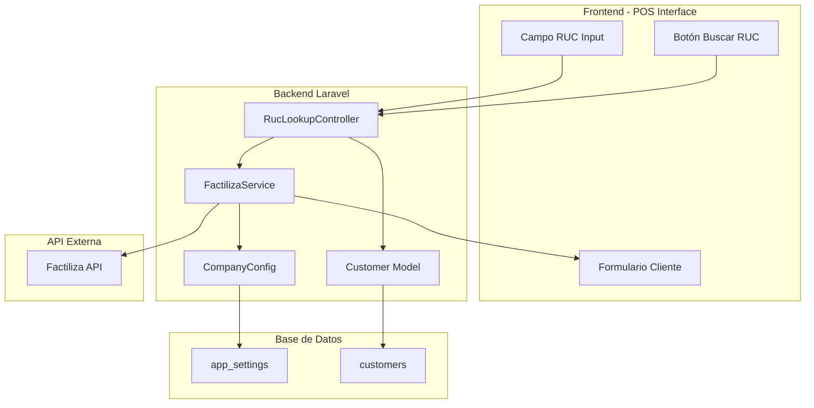
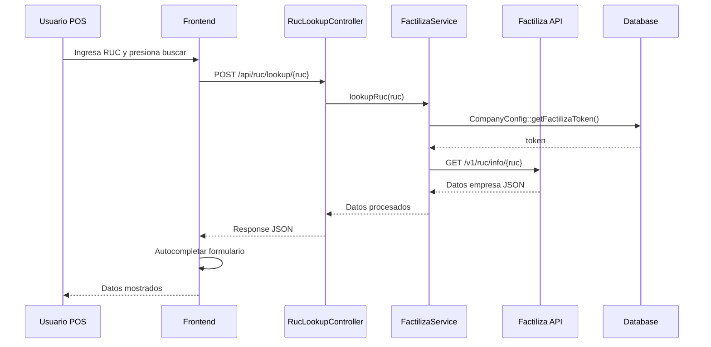
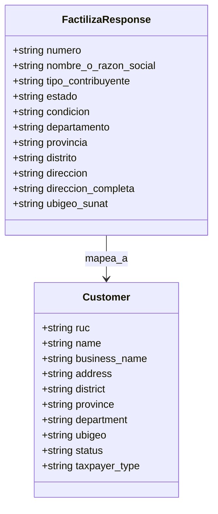
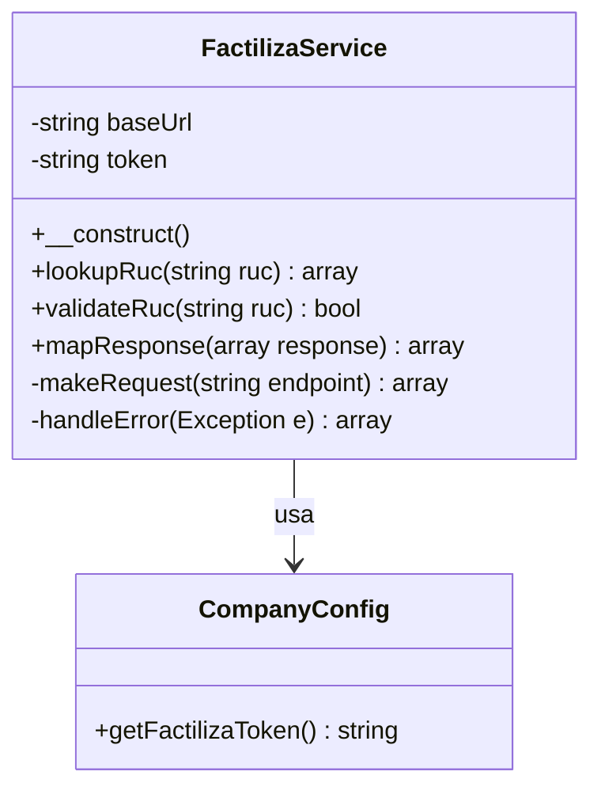
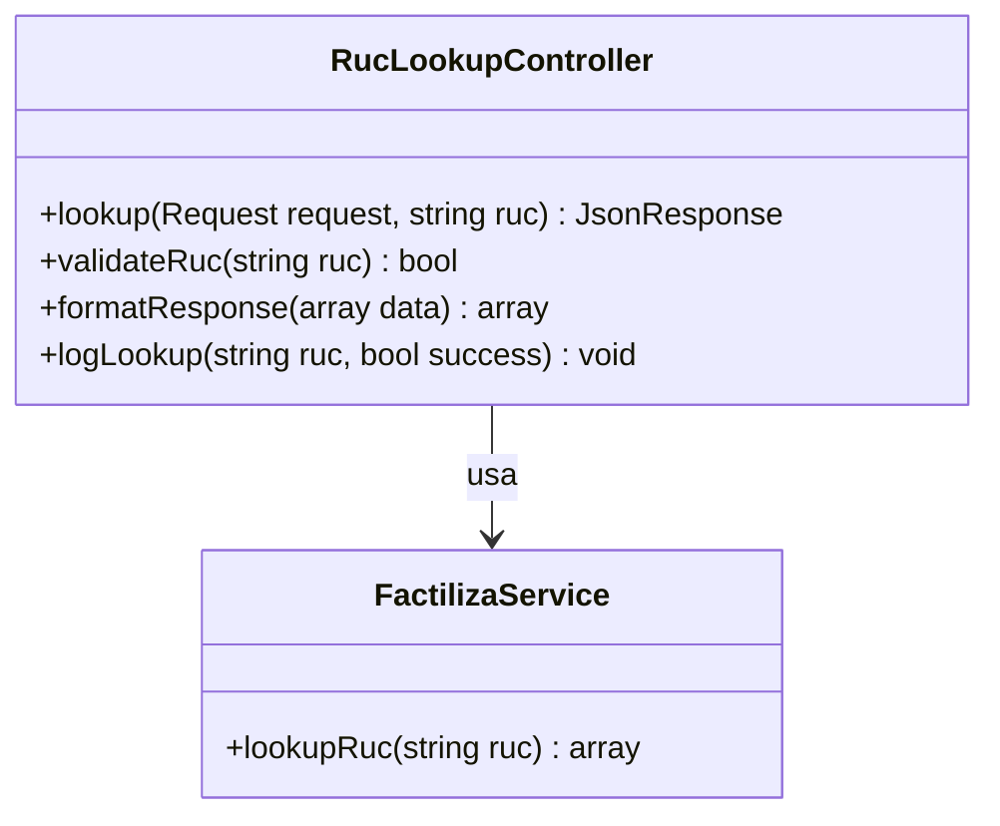
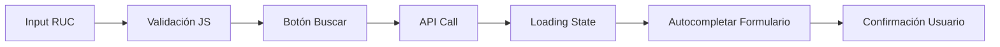
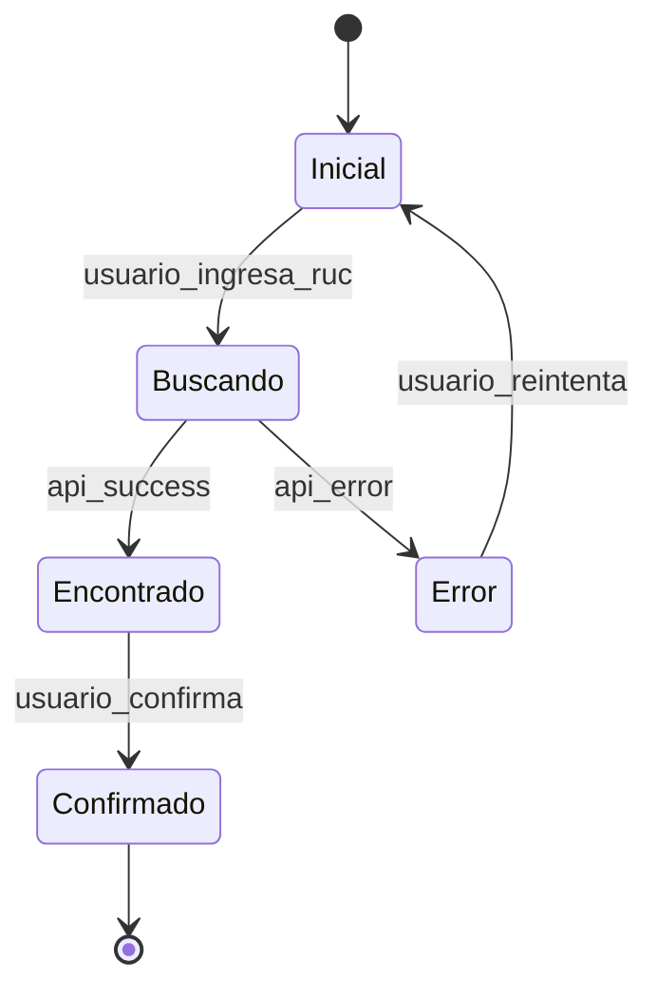
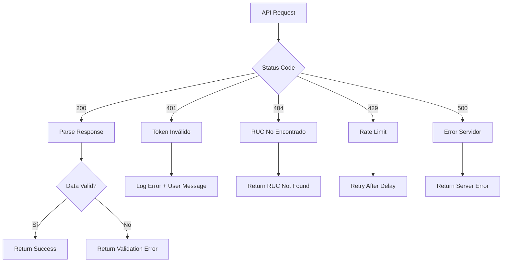

# Servicio de Búsqueda de RUC con Factiliza

## Overview

Este documento describe el diseño e implementación de un servicio de búsqueda de RUC que se integra con la API de Factiliza para obtener automáticamente información de empresas durante el proceso de facturación. El servicio permitirá autocompletar datos del cliente mediante su RUC, mejorando la eficiencia y precisión en la emisión de comprobantes electrónicos.

**Valor del negocio:**
- Automatización del proceso de ingreso de datos de clientes
- Reducción de errores en datos de facturación
- Mejora en la experiencia de usuario del POS
- Validación automática de información empresarial

## Arquitectura

### Componentes del Sistema



### Flujo de Datos



## Configuración del Token

### Almacenamiento en CompanyConfig

El token de Factiliza se almacenará usando el patrón existente del sistema de configuración empresarial:

**Ubicación:** Tab "Empresa" en el modelo `app_settings`

```sql
INSERT INTO app_settings (tab, key, value, created_at, updated_at) 
VALUES ('Empresa', 'factiliza_token', 'tu_token_aqui', NOW(), NOW());
```

### Interfaz de Configuración

La configuración del token se realizará a través del panel administrativo de Filament:

**Ruta:** `/admin/configuracion/empresa`

```
📊 PANEL ADMINISTRATIVO
└── ⚙️ Configuración
    └── 🏢 Datos de la Empresa
        ├── RUC: [20123456789]
        ├── Razón Social: [Mi Empresa SAC]
        ├── ...otros campos...
        └── Token de Factiliza: [********************************]
            🔑 Token de autorización para API de Factiliza (búsqueda de RUC)
```

## API Endpoints Reference

### Búsqueda de RUC

**Endpoint:** `POST /api/ruc/lookup/{ruc}`

**Request Schema:**
```json
{
  "method": "POST",
  "path": "/api/ruc/lookup/{ruc}",
  "parameters": {
    "ruc": "string (11 digits, required)"
  }
}
```

**Response Schema - Éxito:**
```json
{
  "success": true,
  "data": {
    "numero": "20552103816",
    "nombre_o_razon_social": "AGROLIGHT PERU S.A.C.",
    "tipo_contribuyente": "SOCIEDAD ANONIMA CERRADA",
    "estado": "ACTIVO",
    "condicion": "HABIDO",
    "departamento": "LIMA",
    "provincia": "LIMA",
    "distrito": "SANTA ANITA",
    "direccion": "PJ. JORGE BASADRE NRO. 158 URB. POP LA UNIVERSAL 2DA ET.",
    "direccion_completa": "PJ. JORGE BASADRE NRO. 158 URB. POP LA UNIVERSAL 2DA ET., LIMA - LIMA - SANTA ANITA",
    "ubigeo_sunat": "150137"
  }
}
```

**Response Schema - Error:**
```json
{
  "success": false,
  "error": "string",
  "message": "Descripción del error"
}
```

**Authentication Requirements:**
- Token Bearer requerido para API de Factiliza
- Autenticación Laravel estándar para endpoints internos

## Data Models & Mapping

### Modelo Customer - Mapeo de Campos



**Mapping Logic:**
- `numero` → `ruc`
- `nombre_o_razon_social` → `business_name` / `name`
- `direccion_completa` → `address`
- `distrito` → `district`
- `provincia` → `province`
- `departamento` → `department`
- `ubigeo_sunat` → `ubigeo`
- `estado` → `status`
- `tipo_contribuyente` → `taxpayer_type`

## Business Logic Layer

### FactilizaService

**Responsabilidades:**
- Gestión de autenticación con API Factiliza
- Procesamiento y validación de respuestas
- Mapeo de datos a estructura interna
- Manejo de errores y reintentos



### RucLookupController

**Responsabilidades:**
- Validación de entrada
- Orquestación del servicio
- Formateo de respuestas
- Logging de operaciones



## Frontend Integration

### POS Interface Enhancement

**Ubicación en POS:**
- **PosController** (`/pos/invoice/generate/{order}`)
- **UnifiedPaymentController** (`/pos/unified/{order}`)

### Componente de Búsqueda RUC



**Elementos UI:**
- Campo de entrada RUC (11 dígitos)
- Botón "Buscar RUC" con icono
- Indicador de carga durante búsqueda
- Área de previsualización de datos
- Botón "Usar estos datos" para confirmar

### Estados de la Interfaz



## Error Handling & Validation

### Validaciones de Entrada

1. **RUC Format Validation:**
   - Exactamente 11 dígitos
   - Solo números
   - Debe empezar con 10 o 20 (personas jurídicas)

2. **API Response Validation:**
   - Status code 200
   - Estructura JSON válida
   - Campos obligatorios presentes

### Manejo de Errores



### Mensajes de Error

- **Token inválido:** "Error de configuración: Token de Factiliza inválido"
- **RUC no encontrado:** "RUC no encontrado en la base de datos de SUNAT"
- **Formato inválido:** "El RUC debe tener 11 dígitos y empezar con 10 o 20"
- **Error de conexión:** "Error de conexión con el servicio de consulta"

## Testing Strategy

### Unit Tests

1. **FactilizaServiceTest:**
   - Validación de RUC
   - Mapeo de respuestas
   - Manejo de errores de API

2. **RucLookupControllerTest:**
   - Validación de entrada
   - Respuestas correctas
   - Autenticación

### Integration Tests

1. **API Integration:**
   - Mock de Factiliza API
   - Test de flujo completo
   - Validación de datos

2. **Frontend Integration:**
   - Test de componente RUC lookup
   - Autocompletado de formularios
   - Estados de carga y error

### Test Data

```json
{
  "valid_ruc": "20123456789",
  "invalid_ruc": "12345",
  "mock_response": {
    "numero": "20123456789",
    "nombre_o_razon_social": "EMPRESA DE PRUEBA SAC",
    "direccion_completa": "AV. PRUEBA 123, LIMA - LIMA - SAN ISIDRO"
  }
}
```